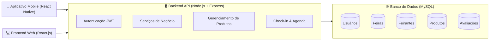

# 🌱 ConectaFeira

Sistema multiplataforma para conectar **feirantes** e **consumidores**, permitindo a divulgação atualizada da oferta de produtos em feiras livres de Fortaleza, a organização das agendas dos feirantes e a busca eficiente por itens de interesse.

> 💡 O tema deste projeto foi elaborado a partir de uma conversa com um feirante da **Feirinha da Beira Mar** e posteriormente expandido para abranger outras feiras da cidade de Fortaleza.

---

## 📌 Problema

Nas feiras livres de Fortaleza, pequenos produtores e feirantes enfrentam dificuldades para **divulgar seus produtos** e atrair consumidores de forma organizada.  
Muitas vezes, os consumidores não sabem **quais produtos estarão disponíveis em determinado dia**, nem em qual feira ou com qual feirante poderão encontrá-los.  

Essa falta de informação gera perda de oportunidades de venda para os feirantes e frustração para os consumidores, além de enfraquecer a valorização da produção local e comunitária.

---

## 📌 Justificativa

As feiras livres têm papel essencial na **economia local** e no acesso a alimentos frescos e de qualidade.  
Entretanto, a ausência de um sistema digital dificulta a visibilidade dos feirantes e a conexão direta com os consumidores.  

Um aplicativo multiplataforma pode transformar esse cenário ao oferecer **transparência sobre os produtos disponíveis**, **organização das agendas dos feirantes** e **facilidade de busca para os consumidores**.  
Dessa forma, o sistema contribui diretamente para o **ODS 11 – Cidades e Comunidades Sustentáveis**, fortalecendo práticas de comércio justo e valorizando a economia comunitária.

---

## 🎯 Objetivos

### Objetivo Geral
Desenvolver um sistema multiplataforma que conecte feirantes e consumidores, permitindo a divulgação atualizada da oferta de produtos, a organização da agenda de feirantes e a busca eficiente por itens de interesse.

### Objetivos Específicos
- Permitir que **administradores** cadastrem feiras e gerenciem feirantes.  
- Oferecer a **feirantes** funcionalidades de cadastro de perfil, produtos, agenda semanal e check-in diário.  
- Disponibilizar aos **consumidores** ferramentas para pesquisar produtos, localizar feiras, consultar agenda de feirantes e avaliar vendedores.  
- Centralizar todas as informações em uma **plataforma digital intuitiva**, acessível via web e mobile.  
- Incentivar práticas sustentáveis, reduzindo desperdícios e valorizando o comércio local.  

---

## 👥 Público-Alvo e Stakeholders

### Público-Alvo
- **Feirantes:** pequenos comerciantes e produtores locais.  
- **Consumidores:** cidadãos em busca de produtos frescos e acessíveis.  

### Stakeholders
- **Administradores da Plataforma:** responsáveis por cadastrar feiras e gerenciar feirantes.  
- **Feirantes:** ofertam produtos, organizam agenda e realizam check-in.  
- **Consumidores:** pesquisam produtos, consultam agendas e avaliam feirantes.  
- **Órgãos Públicos / Associações:** podem utilizar os dados para planejamento e apoio.  
- **Equipe de Desenvolvimento:** responsável pela construção e manutenção do sistema.  

---

## 📂 Estrutura do Repositório

```bash
/ 
├── README.md              # Documentação principal do projeto 
├── docs/                  # Documentação técnica 
│ ├── requirements/ 
│ │ └── requirements.md    # Requisitos funcionais e não-funcionais 
│ ├── architecture/ 
│ │ └── architecture.md    # Documentação da arquitetura do sistema 
│ ├── database/ 
│ │ └── database_model.md  # Modelo de dados com diagrama ER 
│ └── api/ 
│ └── api_specification.md # Especificação das APIs planejadas 
└── prototypes/            # Protótipos de interface 
├── web/                   # Protótipos de interface web 
│ └── [arquivos de imagem] 
└── mobile/                # Protótipos de interface mobile 
└── [arquivos de imagem]
```


---

## 🏗️ Visão Geral da Arquitetura

A arquitetura do **ConectaFeira** segue o modelo **cliente-servidor** baseado em APIs RESTful.  
Ela é composta por três camadas principais:

- **Frontend Web (React.js + Tailwind CSS):**  
  Interface administrativa para cadastro e gestão de feiras, feirantes e produtos.  

- **Aplicativo Mobile (React Native / Android Studio):**  
  Voltado para consumidores e feirantes, permitindo busca de produtos, check-in diário e avaliação.  

- **Backend (Node.js + Express + MySQL):**  
  API centralizada responsável por autenticação, regras de negócio e persistência de dados.  

---

### 🔹 Diagrama da Arquitetura


---
## 💻 Tecnologias Propostas

O projeto **ConectaFeira** será desenvolvido utilizando tecnologias modernas e de fácil manutenção, garantindo escalabilidade e boa experiência para usuários de diferentes perfis (administradores, feirantes e consumidores).

### 🔹 Frontend Web
- **React.js** – Biblioteca JavaScript para construção de interfaces web dinâmicas.  
- **Tailwind CSS** – Framework de estilização para componentes responsivos e modernos.  
- **Axios** – Cliente HTTP para comunicação com a API.  

### 🔹 Mobile
- **React Native** (ou Android Studio com Java, caso necessário) – Desenvolvimento de aplicativo multiplataforma para Android e iOS.  
- **Expo** – Ferramenta para agilizar o desenvolvimento mobile e testes.  

### 🔹 Backend
- **Node.js** – Ambiente de execução JavaScript para o servidor.  
- **Express.js** – Framework web para criação da API RESTful.  
- **JWT (JSON Web Token)** – Autenticação e autorização segura.  

### 🔹 Banco de Dados
- **MySQL** – Banco de dados relacional, já familiar para a equipe, garantindo robustez e confiabilidade.  
- **Sequelize ORM** – Abstração para modelagem de dados e integração com o MySQL.  

### 🔹 Outras Ferramentas
- **Docker** – Containerização para padronizar ambientes de desenvolvimento e produção.  
- **Postman** – Testes e documentação das APIs.  
- **GitHub Projects** – Organização de tarefas, versionamento de código e colaboração.


---
---


## 👨‍💻 Equipe do projeto e seus papéis na Equipe

| Membro                                | Mátricula | Papel na Equipe | Responsabilidades |
|---------------------------------------|---------------------|-----------------|-------------------|
| **Ricardo Montesuma Filho**           | 2327749                   | Líder do Projeto & Desenvolvedor Fullstack | Coordenação geral do projeto, definição da arquitetura, integração entre backend e frontend, acompanhamento das entregas e apoio em todas as áreas técnicas. |
| **Marcos Guilherme Rabelo**           | 2415512                  | Arquiteto de Software & Backend Developer | Definição de padrões arquiteturais, desenvolvimento da API em Node.js, modelagem de banco de dados e regras de negócio. |
| **Fernando Ivo Negreiro da Silva**    | 2317776                   | Frontend Web Developer | Implementação da interface web (React), integração com a API e foco na usabilidade do sistema para administradores e feirantes. |
| **Carlos Roberto Pereira da Silva Filho** | 2326155                | Mobile Developer | Desenvolvimento do aplicativo mobile (Android Studio / React Native), criação dos protótipos e integração com a API. |
| **Antônia Tamires Melo de Sousa**     | 2314703                   | Documentação & QA (Quality Assurance) | Elaboração da documentação do projeto, apoio nos testes funcionais, validação de requisitos e registro de problemas/ajustes. |

---

## 📆 Cronograma de Desenvolvimento

| Etapa                          | Período                 |
|--------------------------------|-------------------------|
| Planejamento e Design           | 10/10 – 15/10           |
| Configuração do Ambiente        | 16/10 – 18/10           |
| Implementação do Backend (API)  | 19/10 – 30/10           |
| Implementação do Frontend Web   | 31/10 – 08/11           |
| Implementação do Mobile         | 09/11 – 15/11           |
| Integração e Testes             | 16/11 – 18/11           |
| Revisão Final e Entrega         | 19/11 – 20/11           |


---

## 📑 Documentação Técnica

- 📋 [Requisitos](docs/requirements/requirements.md)  
- 🏗️ [Arquitetura](docs/architecture/architecture.md)  
- 🗄️ [Modelo de Dados](docs/database/database_model.md)  
- 🌐 [Especificação da API](docs/api/api_specification.md)  

---

## ✅ Conclusão

O **ConectaFeira** busca fortalecer a economia local de Fortaleza ao oferecer um sistema inovador para **aproximar feirantes e consumidores**, incentivando práticas mais sustentáveis e alinhadas ao **ODS 11 – Cidades e Comunidades Sustentáveis**.  


