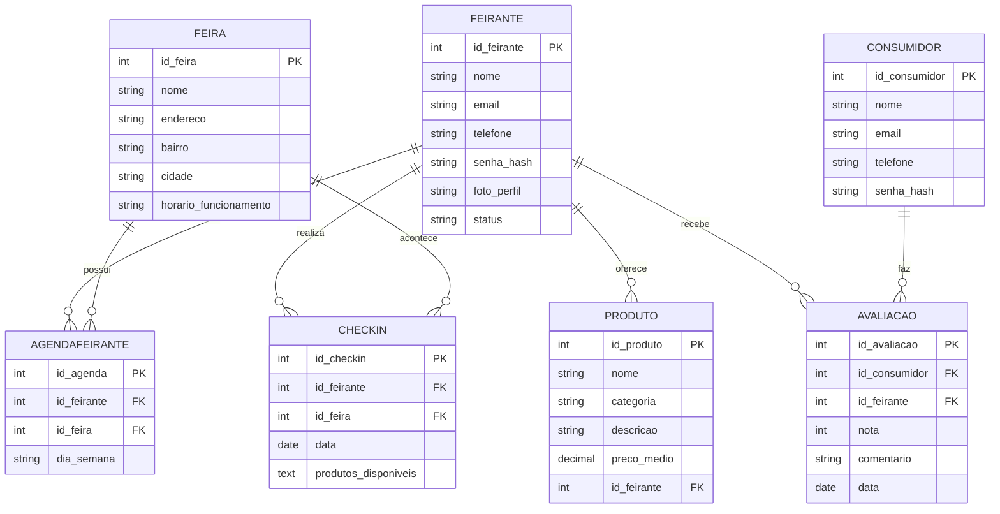

# 🗄️ Modelo de Dados

O banco de dados será relacional, implementado em **MySQL**, e modelado para atender às necessidades de gerenciamento de feiras, feirantes, consumidores e produtos.

---

## 🔹 Entidades Principais

### Feira
- **id_feira** (PK)
- **nome**
- **endereco**
- **bairro**
- **cidade**
- **horario_funcionamento**

---

### Feirante
- **id_feirante** (PK)
- **nome**
- **email**
- **telefone**
- **senha_hash**
- **foto_perfil**
- **status** (ativo/inativo)

---

### Produto
- **id_produto** (PK)
- **nome**
- **categoria**
- **descricao**
- **preco_medio**
- **id_feirante** (FK → Feirante)

---

### AgendaFeirante
- **id_agenda** (PK)
- **id_feirante** (FK → Feirante)
- **id_feira** (FK → Feira)
- **dia_semana** (ex.: segunda, terça, ...)

---

### Checkin
- **id_checkin** (PK)
- **id_feirante** (FK → Feirante)
- **id_feira** (FK → Feira)
- **data**
- **produtos_disponiveis** (texto ou JSON)

---

### Consumidor
- **id_consumidor** (PK)
- **nome**
- **email**
- **telefone**
- **senha_hash**

---

### Avaliacao
- **id_avaliacao** (PK)
- **id_consumidor** (FK → Consumidor)
- **id_feirante** (FK → Feirante)
- **nota** (1 a 5)
- **comentario**
- **data**

---

## 🔹 Diagrama ER (Mermaid)

## 📑 Dicionário de Dados
---
### Tabela: Usuarios
| Campo        | Tipo        | Tamanho | Nulo | Chave | Descrição |
|--------------|-------------|---------|------|-------|-----------|
| id_usuario   | INT         | -       | NÃO  | PK    | Identificador único do usuário |
| nome         | VARCHAR     | 100     | NÃO  | -     | Nome completo do usuário |
| email        | VARCHAR     | 150     | NÃO  | UQ    | E-mail do usuário (único) |
| senha        | VARCHAR     | 255     | NÃO  | -     | Senha criptografada |
| perfil       | ENUM        | -       | NÃO  | -     | Define o tipo de usuário (admin, feirante, consumidor) |

---

### Tabela: Feiras
| Campo        | Tipo        | Tamanho | Nulo | Chave | Descrição |
|--------------|-------------|---------|------|-------|-----------|
| id_feira     | INT         | -       | NÃO  | PK    | Identificador único da feira |
| nome         | VARCHAR     | 100     | NÃO  | -     | Nome da feira |
| endereco     | VARCHAR     | 200     | NÃO  | -     | Endereço da feira |
| bairro       | VARCHAR     | 100     | NÃO  | -     | Bairro onde a feira ocorre |
| cidade       | VARCHAR     | 100     | NÃO  | -     | Cidade da feira |
| horario      | VARCHAR     | 50      | NÃO  | -     | Horário de funcionamento |

---

### Tabela: Feirantes
| Campo          | Tipo        | Tamanho | Nulo | Chave | Descrição |
|----------------|-------------|---------|------|-------|-----------|
| id_feirante    | INT         | -       | NÃO  | PK    | Identificador único do feirante |
| id_usuario     | INT         | -       | NÃO  | FK    | Relaciona com a tabela `Usuarios` |
| telefone       | VARCHAR     | 15      | NÃO  | -     | Telefone de contato |
| status         | ENUM        | -       | NÃO  | -     | Situação do feirante (ativo, inativo) |

---

### Tabela: Produtos
| Campo         | Tipo        | Tamanho | Nulo | Chave | Descrição |
|---------------|-------------|---------|------|-------|-----------|
| id_produto    | INT         | -       | NÃO  | PK    | Identificador único do produto |
| id_feirante   | INT         | -       | NÃO  | FK    | Relaciona com a tabela `Feirantes` |
| nome          | VARCHAR     | 100     | NÃO  | -     | Nome do produto |
| categoria     | VARCHAR     | 50      | NÃO  | -     | Categoria (fruta, verdura, hortaliça etc.) |
| descricao     | TEXT        | -       | SIM  | -     | Descrição do produto |
| preco_medio   | DECIMAL     | 10,2    | NÃO  | -     | Preço médio estimado |

---

### Tabela: Agendas
| Campo        | Tipo        | Tamanho | Nulo | Chave | Descrição |
|--------------|-------------|---------|------|-------|-----------|
| id_agenda    | INT         | -       | NÃO  | PK    | Identificador único da agenda |
| id_feirante  | INT         | -       | NÃO  | FK    | Relaciona com a tabela `Feirantes` |
| id_feira     | INT         | -       | NÃO  | FK    | Relaciona com a tabela `Feiras` |
| dia_semana   | VARCHAR     | 20      | NÃO  | -     | Dia da semana (ex: segunda, terça) |

---

### Tabela: Checkins
| Campo              | Tipo        | Tamanho | Nulo | Chave | Descrição |
|--------------------|-------------|---------|------|-------|-----------|
| id_checkin         | INT         | -       | NÃO  | PK    | Identificador único do check-in |
| id_feirante        | INT         | -       | NÃO  | FK    | Relaciona com a tabela `Feirantes` |
| id_feira           | INT         | -       | NÃO  | FK    | Relaciona com a tabela `Feiras` |
| data               | DATE        | -       | NÃO  | -     | Data do check-in |
| produtos_disponiveis | TEXT      | -       | NÃO  | -     | Lista de produtos ofertados no dia |

---

### Tabela: Avaliacoes
| Campo          | Tipo        | Tamanho | Nulo | Chave | Descrição |
|----------------|-------------|---------|------|-------|-----------|
| id_avaliacao   | INT         | -       | NÃO  | PK    | Identificador único da avaliação |
| id_consumidor  | INT         | -       | NÃO  | FK    | Relaciona com a tabela `Usuarios` (perfil consumidor) |
| id_feirante    | INT         | -       | NÃO  | FK    | Relaciona com a tabela `Feirantes` |
| nota           | INT         | -       | NÃO  | -     | Avaliação de 1 a 5 estrelas |
| comentario     | TEXT        | -       | SIM  | -     | Comentário opcional do consumidor |
| data           | DATE        | -       | NÃO  | -     | Data da avaliação |

---
